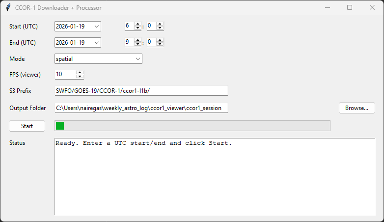

# CCOR-1 FITS Downloader & Viewer

A Tkinter-based GUI tool for browsing, downloading, processing, and viewing
NOAA CCOR-1 Level-1B coronagraph FITS images by date range.

Designed for:
- stepping frame-by-frame
- timed playback (movie mode)
- visual searching for faint moving objects (e.g. comets)

## Features
- Calendar-based start/end date selection (UTC)
- S3 listing from NOAA public bucket
- Pre-download confirmation (file count + MB)
- Multiple processing modes:
  - Spatial high-pass (best for comet hunting)
  - Temporal median (CME enhancement)
  - Running difference
- Adjustable playback FPS
- Cached PNG frames for smooth viewing


## Data Source
Public NOAA S3 bucket:


Images are CCOR-1 Level-1B FITS, calibrated to Mean Solar Brightness (MSB).

## Installation

```bash
pip install -r requirements.txt
```

## Usage
python ccor1_viewer.py

- Select start and end date/time (UTC)

- Click Start

- Confirm download size

- Viewer opens automatically when processing completes

## Notes

This tool is intended for visualization and manual inspection.

Processed images are not photometrically linear after enhancement.

CCOR-1 data is currently preliminary/non-operational per NOAA metadata.
